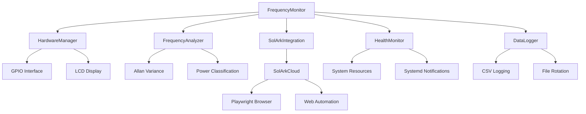

# 🔌 RpiSolarkMonitor

<div align="center">


**A sophisticated frequency monitoring system for Raspberry Pi that detects power source (Utility Grid vs Generator) by analyzing AC line frequency stability.**

</div>

---

## 🔬 How It Works: Frequency Analysis & Power Source Detection

### 🎯 **The Core Problem**

The system solves a critical challenge: **How do you automatically detect whether your home is powered by the utility grid or a backup generator?** This is essential for:

- Automatic inverter parameter switching
- Load management decisions
- Safety systems
- Energy management optimization

### ⚡ **The Solution: Frequency Analysis**

Unlike voltage (which can be similar for both sources), **frequency behavior is dramatically different** between utility grid and generators:

<div align="center">


|       Power Source       |   Frequency Characteristics   |                        Why This Happens                        |
| :------------------------: | :------------------------------: | :---------------------------------------------------------------: |
|   **🏢 Utility Grid**   |  Rock-solid 60.00 ± 0.01 Hz  |   Massive interconnected system with thousands of generators   |
| **🔧 Generac Generator** | 59-64 Hz with hunting patterns | Single engine with mechanical governor trying to maintain speed |

</div>

### 🔍 **What is Frequency Hunting?**

**Frequency hunting** is a characteristic instability pattern where a generator's frequency oscillates around the target frequency (60 Hz) in a cyclical pattern. This is the "smoking gun" that distinguishes generators from utility power.

#### 🎯 **Why Generators Hunt:**

Generators hunt because they use mechanical governors that try to maintain 3600 RPM (60 Hz), but load changes cause speed variations. The governor overcorrects, causing overshoot, and the system oscillates around the target speed, creating characteristic hunting patterns. This instability is much more pronounced in single-cylinder engines, air-cooled units, and older generators.

*For detailed technical explanations of hunting patterns, real-world examples, and detection algorithms, see [FREQUENCY_ANALYSIS.md](FREQUENCY_ANALYSIS.md).*

#### 📈 **Visual Example of Frequency Hunting:**

```
Utility Grid (Stable):
Frequency: 60.00 Hz ± 0.01 Hz
    60.01 ┤
    60.00 ┼────────────────────────────────
    59.99 ┤
    Time: 0    5    10   15   20   25 seconds

Generator (Hunting):
Frequency: 59-64 Hz with hunting pattern
    64.0 ┤     ╭─╮
    62.0 ┤   ╭─╯   ╰─╮
    60.0 ┼───╯         ╰───╮
    58.0 ┤                 ╰─╮
    56.0 ┤                   ╰─
    Time: 0    5    10   15   20   25 seconds
```

*The generator shows characteristic hunting oscillations while utility power remains rock-solid.*

### 🧮 **Detection Algorithm**

The system uses **three complementary analysis methods** to detect power sources:


|      Analysis Method      |         What It Detects         |                Why It Works                |
| :-------------------------: | :--------------------------------: | :-------------------------------------------: |
|   **📊 Allan Variance**   | Short-term frequency instability |        Captures hunting oscillations        |
| **📈 Standard Deviation** |    Overall freqauency spread    |        Detects wide frequency ranges        |
|      **📉 Kurtosis**      |   Distribution shape analysis   | Identifies hunting patterns vs random noise |

*For detailed mathematical formulas, implementation details, and metric effectiveness analysis, see [FREQUENCY_ANALYSIS.md](FREQUENCY_ANALYSIS.md).*

### 🎯 **Why This Works So Well**

1. **Utility Grid**: Massive interconnected system with thousands of generators provides rock-solid frequency stability
2. **Generators**: Single engine with mechanical governor creates characteristic hunting patterns
3. **Pattern Recognition**: The combination of three metrics catches different types of instability
4. **Real-World Tested**: Algorithm trained on actual generator data from various models

## 📊 Features

- ⚡ **Real-time frequency monitoring** using optocoupler input
- 🔍 **Power source classification** (Utility Grid vs Generac Generator)
- 📈 **Allan variance analysis** for frequency stability assessment
- 📺 **LCD display** with real-time status updates and U/G indicator
- 🎯 **U/G indicator** showing majority classification over recent data window
- 🏥 **Health monitoring** with system resource tracking
- 🛡️ **Graceful degradation** when hardware is unavailable
- 📝 **Comprehensive logging** with hourly status reports
- ⚙️ **Configurable parameters** via YAML configuration
- ☁️ **Sol-Ark cloud integration** with web automation (Playwright)
- 🤖 **Automatic parameter updates** based on power source detection
- 🔄 **Persistent state management** with automatic recovery after restarts
- 🛡️ **Resource leak prevention** with comprehensive cleanup verification
- 🔧 **Hardware error recovery** with automatic optocoupler health checks
- 📊 **Buffer corruption detection** with automatic data validation
- 🔒 **Atomic file operations** for power-loss safe data logging
- ⚡ **Systemd watchdog integration** for automatic service restart

## 📺 Display Interface

### 🖥️ Live Simulator Output

```
+-----------------+
|Time: 19:07:06  |
|Freq: 60.00 Hz  |
+-----------------+

----------------------
System Status:
  Mode: SIMULATOR
  LCD: SIMULATED
======================
Press Ctrl+C to stop
```

*Real-time console output showing frequency monitoring in simulator mode*

### 🖥️ LCD Display Interface

The 2-line LCD display provides comprehensive real-time information:

#### 🔌 Utility Grid Mode

```
Time: 14:32:15 [U]
Freq: 60.02 Hz
Status: UTILITY GRID
Stability: EXCELLENT
```

#### ⚡ Generator Mode

```
Time: 14:32:15 [G]
Freq: 59.87 Hz
Status: GENERATOR
Stability: POOR
```

*The [U] or [G] indicator shows the majority classification over the last 5 minutes of data.*

## 🔧 Hardware Requirements


|        Component        |          Specification          |           Purpose           |
| :------------------------: | :-------------------------------: | :---------------------------: |
|    🍓**Raspberry Pi**    | Any model (3B+, 4B recommended) |    Main processing unit    |
| 🔌**H11AA1 Optocoupler** |        AC line isolation        |  Safe frequency detection  |
|    📺**16x2 I2C LCD**    |          Address 0x27          |  Real-time status display  |
|    🔘**Reset Button**    |      Momentary push button      | Manual system reset/restart |
|     🔗**Resistors**     |           1kΩ, 10kΩ           |     Circuit protection     |

### 📋 Shopping List

- [ ] Raspberry Pi 4B (4GB recommended)
- [ ] H11AA1 optocoupler
- [ ] 16x2 I2C LCD display (0x27 address)
- [ ] Momentary push button (reset button)
- [ ] 1kΩ resistor
- [ ] 10kΩ resistor
- [ ] Breadboard and jumper wires
- [ ] MicroSD card (32GB+)
- [ ] Power supply (5V, 3A)

## 🚀 Quick Start

### 📥 Installation & Setup

#### 🚀 Using uv (Recommended - Fastest)

```bash
# Clone the repository
git clone https://github.com/yourusername/RpiSolarkMonitor.git
cd RpiSolarkMonitor

# Install uv if you don't have it
curl -LsSf https://astral.sh/uv/install.sh | sh

# Install dependencies using uv
uv sync

# Install Playwright browser
playwright install chromium

# Enable I2C interface
sudo raspi-config  # Navigate to: Interfacing Options → I2C → Enable

# Run in simulator mode (no hardware required)
python monitor.py --simulator

# Run with real hardware
python monitor.py --real
```

### 🔧 Hardware Configuration


|      Component      | GPIO Pin |       Connection       |
| :--------------------: | :--------: | :-----------------------: |
| 🔌 Optocoupler Input | GPIO 17 | AC line via optocoupler |
|   🔘 Reset Button   | GPIO 22 | Active LOW with pull-up |
|      📺 I2C LCD      | SDA/SCL |      Address 0x27      |

#### 🔘 Reset Button Wiring

```
Raspberry Pi GPIO 22 ──┬─── Button ─── GND
                       │
                     10kΩ
                       │
                     3.3V
```

- **Active LOW**: Button press connects GPIO 22 to GND
- **Pull-up resistor**: 10kΩ resistor to 3.3V keeps pin HIGH when button released
- **Debounced**: Software handles button press/release detection
- **Function**: Restarts entire application when pressed

## 📖 Usage

### 🎮 Basic Commands

<div align="center">


|                Command                |        Description        |           Use Case           |
| :--------------------------------------: | :--------------------------: | :----------------------------: |
|          `python monitor.py`          |   Default simulator mode   |   Testing without hardware   |
|       `python monitor.py --real`       |     Real hardware mode     |    Production deployment    |
|     `python monitor.py --verbose`     |      Verbose logging      |       Debugging issues       |
| `python monitor.py --detailed-logging` | Detailed frequency logging | Data collection for analysis |
|     `python test_solark_cloud.py`     |   Test cloud integration   |  Verify Sol-Ark connection  |

</div>
### 📊 Detailed Logging Mode

```bash
# Enable detailed logging (1 second intervals)
python monitor.py --detailed-logging

# Analyze collected data offline
python monitor.py --analyze-offline
```

*Captures every frequency reading with full analysis data for debugging classification issues. See [FREQUENCY_ANALYSIS.md](FREQUENCY_ANALYSIS.md) for complete documentation.*

## ⚙️ Configuration

The system uses a comprehensive YAML configuration file `config.yaml` with settings for:


|      Category      |              Settings              |             Description             |
| :-------------------: | :-----------------------------------: | :------------------------------------: |
|   🔧**Hardware**   |       GPIO pins, LCD address       |   Hardware interface configuration   |
|   📊**Sampling**   |    Sample rate, buffer duration    |      Data collection parameters      |
|   🎯**Analysis**   |        Detection thresholds        | Power source classification criteria |
|    📝**Logging**    |         Log files, rotation         |      Logging and data retention      |
|    🏥**Health**    |  Resource thresholds, systemd watchdog |   System health monitoring   |
|   ☁️**Sol-Ark**   |     Credentials, sync intervals     |      Cloud integration settings      |
| 🛡️**Reliability** | State persistence, recovery actions |     Long-term operation settings     |

### 🛡️ **New Reliability Configuration Options**

**⚠️ Important**: The system now requires a complete `config.yaml` file. Missing configuration will cause the application to crash with clear error messages.

```yaml
# Persistent State Management
state_machine:
  persistent_state_enabled: true
  state_file: '/var/run/rpisolark_state.json'
  confidence_threshold_maintain: 0.6
  confidence_threshold_transition: 0.8

# Hardware Error Recovery
hardware:
  optocoupler:
    max_consecutive_errors: 5
    health_check_interval: 30.0
    max_recovery_attempts: 3

# System Health Monitoring
health:
  memory_warning_threshold: 0.8
  cpu_warning_threshold: 0.8
```

**Configuration Philosophy**: The system now follows a "fail-fast" approach - if configuration is missing or invalid, the application will crash immediately with clear error messages rather than using potentially incorrect defaults.

## 📁 Output Files


|                 File                 |        Description        |          Format          |
| :------------------------------------: | :--------------------------: | :-------------------------: |
|        📊`hourly_status.csv`        |   Hourly status reports   |    CSV with timestamps    |
|           📝`monitor.log`           | Detailed application logs |    Rotating log files    |
|         ☁️`solark_cache/`         | Cached Sol-Ark cloud pages |  HTML files for analysis  |
|       🔄`solark_session.json`       |        Session data        |   JSON session storage   |
| 🛡️`/var/run/rpisolark_state*.json` |   Persistent state files   |    JSON state storage    |
|         📊`memory_usage.csv`         |   Memory monitoring data   | CSV with resource metrics |
|   📈`detailed_frequency_data.csv`   |  Detailed frequency logs  |  CSV with analysis data  |

## 🧪 Testing

```bash
# Run unit tests
pytest

# Test specific components
pytest tests/test_monitor.py
pytest tests/test_solark_cloud.py
pytest tests/test_optocoupler.py

# Test Sol-Ark cloud connection
python tests/test_solark_cloud.py

# Test hardware components
python tests/test_optocoupler.py
```

## 🏗️ Architecture

The system is built with a modular, extensible architecture:

<div align="center">



</div>

### 🔧 Core Components

<div align="center">


|         Component         |           Purpose           |          Key Features          |
| :-------------------------: | :---------------------------: | :------------------------------: |
|  🎯**FrequencyMonitor**  | Main application controller |  Orchestrates all components  |
|   🔧**HardwareManager**   | Hardware abstraction layer |  Graceful degradation support  |
|  📊**FrequencyAnalyzer**  |  Frequency analysis engine  | Allan variance, classification |
|    🏥**HealthMonitor**    |   System health tracking   | Resource monitoring, systemd notifications |
|     📝**DataLogger**     |      Data persistence      |   CSV logging, file rotation   |
| ☁️**SolArkIntegration** |   Cloud integration layer   |   Parameter synchronization   |
|     🤖**SolArkCloud**     |       Web automation       |  Playwright-based interaction  |

**Data Flow**: AC line frequency → Real-time analysis → LCD display/logging → Sol-Ark cloud updates

## 🎯 U/G Indicator Feature

The U/G indicator shows the majority power source classification over a configurable time window (default: 5 minutes), providing stable indication:

- **U** - Utility Grid (majority of recent classifications)
- **G** - Generator (majority of recent classifications)
- **?** - Unknown/Equal (insufficient data or tied classifications)

**Configuration**: Set `display.classification_window` in `config.yaml` (default: 300 seconds)

## ☁️ Sol-Ark TOU Automation System

**Complete automation system** for controlling Sol-Ark inverter Time of Use (TOU) settings via web automation.

### 🎯 **What It Does**

Automatically:

- **Logs into Sol-Ark Cloud** using your credentials
- **Finds your specific inverter** by serial number
- **Navigates to Parameters Setting** via dropdown menu
- **Toggles TOU switch** ON or OFF as needed
- **Saves changes** with verification

### 🚀 **Quick Start**

```bash
# Test complete automation flow
python test_inverter_automation.py

# Test simple TOU toggle
python test_tou_verification.py
```

### 🔧 **Usage in Code**

```python
from solark_cloud import SolArkCloud

solark = SolArkCloud()
await solark.initialize()
await solark.login()

# Toggle TOU ON/OFF
result = await solark.toggle_time_of_use(True, "2207079903")
result = await solark.toggle_time_of_use(False, "2207079903")
```

**Key Features**: Multiple click methods, smart navigation, success verification, session management, error recovery

## 📊 Monitoring

**Comprehensive monitoring** with real-time LCD display, system health tracking, hourly logging, and cloud sync capabilities.

**Health Metrics**: CPU usage, memory consumption, watchdog timer, frequency stability, power source classification, network status


|     Monitoring Type     |      Description      |         Output         |
| :-----------------------: | :---------------------: | :-----------------------: |
| 📺**Real-time Display** |  LCD status updates  |    Visual indicators    |
|   🏥**System Health**   | CPU, memory, watchdog |   Resource monitoring   |
|  📝**Hourly Logging**  |    Status reports    |        CSV files        |
| 📋**Application Logs** |   Detailed logging   |   Rotating log files   |
|   ☁️**Cloud Sync**   |  Sol-Ark integration  |    Parameter updates    |
| ⚡**Power Management** | Source-based changes | Utility/Generator modes |

</div>

### 📈 Health Metrics

- **CPU Usage**: Real-time processor utilization
- **Systemd Watchdog**: Service health monitoring via systemd
- **Frequency Stability**: Allan variance analysis
- **Power Source**: Utility vs Generator classification
- **Network Status**: Cloud connectivity monitoring

## 🛡️ Long-Term Reliability Features

**Designed for 5+ years of continuous operation** with comprehensive reliability improvements:

### 🔄 **Persistent State Management**

- **JSON-based state persistence** survives restarts and power outages
- **Atomic file writes** prevent corruption during power loss
- **Duplicate action prevention** avoids redundant operations after restart
- **State validation** with automatic fallback to safe defaults

### 🔧 **Hardware Error Recovery**

- **Optocoupler health checks** with automatic recovery mechanisms
- **Counter reset and re-initialization** on hardware failures
- **Configurable error thresholds** with graceful degradation
- **Hardware status monitoring** with detailed health reporting

### 📊 **Data Integrity Protection**

- **Buffer corruption detection** identifies and clears invalid data
- **Periodic validation** checks for NaN/inf values and monotonic time
- **Atomic CSV writes** with file locking for concurrent access
- **Power-loss safe operations** using temporary files and atomic renames

### ⚡ **Automated Recovery Systems**

- **Systemd watchdog integration**: Automatic service restart on unresponsiveness
- **Loop rate monitoring** detects system slowdowns
- **Recovery detection** tracks system responsiveness
- **Fallback mechanisms** for failed recovery attempts

### ⚙️ **Robust Configuration**

- **Comprehensive validation** with type checking and range validation
- **Complete default configuration** prevents runtime errors
- **Fail-fast startup** with clear error messages
- **Configuration schema** for future migrations

## MicroSD wear reduction (moderate)

Goal: keep root writable; retain your app's hourly write; curb OS background writes.

### 1) Put systemd journal in RAM (volatile)

```bash
sudo cp /etc/systemd/journald.conf /etc/systemd/journald.conf.bak
sudo sed -i 's/^#\?Storage=.*/Storage=volatile/' /etc/systemd/journald.conf
sudo systemctl restart systemd-journald
# Optional: disable rsyslog if installed
sudo systemctl disable --now rsyslog || true
```

Revert: restore the backup or set `Storage=auto` and re‑enable rsyslog.

### 2) Disable APT periodic background jobs

```bash
cat | sudo tee /etc/apt/apt.conf.d/02periodic-disable >/dev/null <<'EOF'
APT::Periodic::Enable "0";
APT::Periodic::Update-Package-Lists "0";
APT::Periodic::Download-Upgradeable-Packages "0";
APT::Periodic::AutocleanInterval "0";
EOF
sudo systemctl disable --now apt-daily.timer apt-daily-upgrade.timer || true
```

Revert: remove that file and re‑enable the timers.

### 3) Reduce filesystem metadata writes (noatime)

```bash
sudo cp /etc/fstab /etc/fstab.bak
# Edit the / and /boot lines to include noatime (example):
# PARTUUID=xxxx  /      ext4  defaults,noatime  0  1
# PARTUUID=yyyy  /boot  vfat  defaults,noatime  0  2
# Then reboot to apply:
sudo reboot
```

Optional: also add `commit=600` to the ext4 options to flush journal less often (higher data loss risk on power loss).

### 4) Use RAM for /tmp

```bash
grep -qE '^tmpfs\s+/tmp\s+tmpfs' /etc/fstab || echo 'tmpfs /tmp tmpfs defaults,nosuid,nodev 0 0' | sudo tee -a /etc/fstab
sudo mount -a
```

### 5) Optional: fake-hwclock timer (if NTP is available)

```bash
# Only if you use NTP (systemd-timesyncd or chrony)
sudo systemctl disable --now fake-hwclock.timer || true
sudo systemctl enable --now systemd-timesyncd || true
```

### Verify

```bash
findmnt -no OPTIONS / | grep -q noatime && echo OK:noatime || echo MISSING:noatime
systemctl show -p Storage systemd-journald | grep volatile || echo 'journald not volatile'
findmnt /tmp
```

### Expected endurance

- Your hourly write dominates. 100 KB/hour ≈ 0.9 GB/year; 1 MB/hour ≈ 8.8 GB/year. Both are safe for quality microSD over 10 years. The steps above largely remove incidental OS writes.

## 🔧 Troubleshooting

### 🚨 Common Issues


|              Issue              |      Symptoms      |             Solution             |
| :-------------------------------: | :-------------------: | :---------------------------------: |
|    🔌**GPIO Access Denied**    |  Permission errors  |   `sudo usermod -a -G gpio pi`   |
|    📺**LCD Not Displaying**    |    Blank screen    | Check I2C address and connections |
| ☁️**Cloud Connection Failed** | Sol-Ark sync errors |   Check credentials and network   |
| 📊**Frequency Reading Errors** |    Invalid data    |  Verify optocoupler connections  |

### 🔍 Diagnostic Steps

1. **📝 Check Logs**: Review `monitor.log` for detailed error information
2. **🔧 Verify Hardware**: Ensure proper GPIO connections and power supply
3. **🧪 Test in Simulator**: Use `--simulator` flag to test without hardware
4. **🔐 Check Permissions**: Ensure GPIO access permissions are correct
5. **⚙️ Review Configuration**: Verify `config.yaml` settings
6. **☁️ Test Sol-Ark Integration**: Run `python test_solark_cloud.py`

## 🤝 Contributing

**We welcome contributions!** Fork the repository, create a feature branch, commit your changes, and open a Pull Request.

**Guidelines**: Follow PEP 8 Python style, add tests for new features, update documentation, use clear commit messages.

## 📄 License

**GNU Lesser General Public License v3.0 (LGPL-3.0)**

**Allows**: Use in proprietary applications, modify and distribute, link with proprietary code, distribute under any license.

**Note**: If you modify this library itself, you must make your changes available under the LGPL.

## 🙏 Acknowledgments

- **Raspberry Pi Foundation** for the amazing hardware platform
- **Sol-Ark** for the inverter cloud integration
- **Python Community** for the excellent libraries and tools
- **Contributors** who help improve this project

---

<div align="center">

**⭐ If you find this project helpful, please give it a star! ⭐**

[🔝 Back to Top](#-rpisolarkmonitor)

</div>
