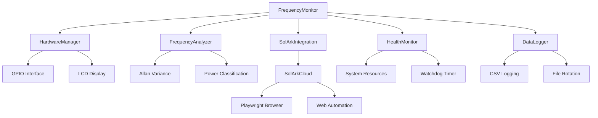

# 🔌 RpiSolarkMonitor

<div align="center">


**A sophisticated frequency monitoring system for Raspberry Pi that detects power source (Utility Grid vs Generator) by analyzing AC line frequency stability.**

[📖 Documentation](#documentation) • [🚀 Quick Start](#quick-start) • [🔧 Configuration](#configuration) • [📊 Features](#features)

</div>

---


## 🔬 How It Works: Frequency Analysis & Power Source Detection

### 🎯 **The Core Problem**

The system solves a critical challenge: **How do you automatically detect whether your home is powered by the utility grid or a backup generator?** This is essential for:
- Automatic inverter parameter switching
- Load management decisions
- Safety systems
- Energy management optimization

### ⚡ **The Solution: Frequency Analysis**

Unlike voltage (which can be similar for both sources), **frequency behavior is dramatically different** between utility grid and generators:

<div align="center">

| Power Source | Frequency Characteristics | Why This Happens |
|:---:|:---:|:---:|
| **🏢 Utility Grid** | Rock-solid 60.00 ± 0.01 Hz | Massive interconnected system with thousands of generators |
| **🔧 Generac Generator** | 59-64 Hz with hunting patterns | Single engine with mechanical governor trying to maintain speed |

</div>

### 🔍 **What is Frequency Hunting?**

**Frequency hunting** is a characteristic instability pattern where a generator's frequency oscillates around the target frequency (60 Hz) in a cyclical pattern. This is the "smoking gun" that distinguishes generators from utility power.

#### 🎯 **Why Generators Hunt:**

Generators hunt because they use mechanical governors that try to maintain 3600 RPM (60 Hz), but load changes cause speed variations. The governor overcorrects, causing overshoot, and the system oscillates around the target speed, creating characteristic hunting patterns. This instability is much more pronounced in single-cylinder engines, air-cooled units, and older generators.

*For detailed technical explanations of hunting patterns, real-world examples, and detection algorithms, see [FREQUENCY_ANALYSIS.md](FREQUENCY_ANALYSIS.md).*

#### 📈 **Visual Example of Frequency Hunting:**

```
Utility Grid (Stable):
Frequency: 60.00 Hz ± 0.01 Hz
    60.01 ┤
    60.00 ┼────────────────────────────────
    59.99 ┤
    Time: 0    5    10   15   20   25 seconds

Generator (Hunting):
Frequency: 59-64 Hz with hunting pattern
    64.0 ┤     ╭─╮
    62.0 ┤   ╭─╯   ╰─╮
    60.0 ┼───╯         ╰───╮
    58.0 ┤                 ╰─╮
    56.0 ┤                   ╰─
    Time: 0    5    10   15   20   25 seconds
```

*The generator shows characteristic hunting oscillations while utility power remains rock-solid.*

### 🧮 **Detection Algorithm**

The system uses **three complementary analysis methods** to detect power sources:

| Analysis Method | What It Detects | Why It Works |
|:---:|:---:|:---:|
| **📊 Allan Variance** | Short-term frequency instability | Captures hunting oscillations |
| **📈 Standard Deviation** | Overall freqauency spread | Detects wide frequency ranges |
| **📉 Kurtosis** | Distribution shape analysis | Identifies hunting patterns vs random noise |

*For detailed mathematical formulas, implementation details, and metric effectiveness analysis, see [FREQUENCY_ANALYSIS.md](FREQUENCY_ANALYSIS.md).*

### 🎯 **Why This Works So Well**

1. **Utility Grid**: Massive interconnected system with thousands of generators provides rock-solid frequency stability
2. **Generators**: Single engine with mechanical governor creates characteristic hunting patterns
3. **Pattern Recognition**: The combination of three metrics catches different types of instability
4. **Real-World Tested**: Algorithm trained on actual generator data from various models

## 📊 Features

<div align="center">

| 🎯 **Core Monitoring** | 🔧 **Smart Integration** | 📱 **User Interface** |
|:---:|:---:|:---:|
| Real-time frequency analysis | Sol-Ark cloud integration (WIP) | LCD display with status |
| Power source classification | Automatic parameter updates (WIP) | Web dashboard |
| Allan variance analysis | Web automation (Playwright) | Comprehensive logging |
| Health monitoring | Graceful degradation | Real-time status updates |

</div>

### 🌟 Key Capabilities

- ⚡ **Real-time frequency monitoring** using optocoupler input

- 🔍 **Power source classification** (Utility Grid vs Generac Generator)

- 📈 **Allan variance analysis** for frequency stability assessment

- 📺 **LCD display** with real-time status updates and U/G indicator

- 🎯 **U/G indicator** showing majority classification over recent data window

- 🏥 **Health monitoring** with system resource tracking

- 🛡️ **Graceful degradation** when hardware is unavailable

- 📝 **Comprehensive logging** with hourly status reports

- ⚙️ **Configurable parameters** via YAML configuration

## 📺 Display Interface

### 🖥️ Live Simulator Output

```
+-----------------+
|Time: 19:07:06  |
|Freq: 60.00 Hz  |
+-----------------+

----------------------
System Status:
  Mode: SIMULATOR
  LCD: SIMULATED
======================
Press Ctrl+C to stop
```

*Real-time console output showing frequency monitoring in simulator mode*

### 🖥️ LCD Display Interface

The 2-line LCD display provides comprehensive real-time information:

#### 🔌 Utility Grid Mode
```
Time: 14:32:15 [U]
Freq: 60.02 Hz
Status: UTILITY GRID
Stability: EXCELLENT
```

#### ⚡ Generator Mode  
```
Time: 14:32:15 [G]
Freq: 59.87 Hz
Status: GENERATOR
Stability: POOR
```

*Real-time frequency monitoring showing timestamp with U/G indicator, frequency reading, power source classification, and stability assessment. The [U] or [G] indicator shows the majority classification over the last 5 minutes of data.*

### 📊 Web Dashboard

*Separate Flask-based web dashboard for system health monitoring (run with `python dashboard.py`)*

### 🔧 Hardware Setup

*Clean hardware setup with optocoupler isolation and LCD display*

### 📈 Frequency Analysis

*Advanced frequency analysis showing Allan variance and stability metrics*

## 🔧 Hardware Requirements

<div align="center">

| Component | Specification | Purpose |
|:---:|:---:|:---:|
| 🍓 **Raspberry Pi** | Any model (3B+, 4B recommended) | Main processing unit |
| 🔌 **H11AA1 Optocoupler** | AC line isolation | Safe frequency detection |
| 📺 **16x2 I2C LCD** | Address 0x27 | Real-time status display |
| 🔘 **Reset Button** | Momentary push button | Manual system reset/restart |
| 🔗 **Resistors** | Various values | Circuit protection |

</div>

### 📋 Shopping List

- [ ] Raspberry Pi 4B (4GB recommended)
- [ ] H11AA1 optocoupler
- [ ] 16x2 I2C LCD display (0x27 address)
- [ ] Momentary push button (reset button)
- [ ] 1kΩ resistor
- [ ] 10kΩ resistor
- [ ] Breadboard and jumper wires
- [ ] MicroSD card (32GB+)
- [ ] Power supply (5V, 3A)

## 🚀 Quick Start

### 📥 Installation

```bash
# Clone the repository
git clone https://github.com/yourusername/RpiSolarkMonitor.git
cd RpiSolarkMonitor

# Install Python dependencies
pip install -r requirements.txt

# Install Playwright browsers (for Sol-Ark cloud integration - WIP)
playwright install chromium

# Enable I2C interface (if not already enabled)
sudo raspi-config
# Navigate to: Interfacing Options → I2C → Enable
```

### ⚡ Quick Setup

```bash
# Run in simulator mode (no hardware required)
python monitor.py --simulator

# Run with real hardware
python monitor.py --real

# Enable verbose logging
python monitor.py --verbose
```

### 🔧 Hardware Configuration

<div align="center">

| Component | GPIO Pin | Connection |
|:---:|:---:|:---:|
| 🔌 Optocoupler Input | GPIO 17 | AC line via optocoupler |
| 🔘 Reset Button | GPIO 22 | Active LOW with pull-up |
| 📺 I2C LCD | SDA/SCL | Address 0x27 |

</div>

#### 🔘 Reset Button Wiring
The reset button provides manual system reset/restart functionality:

```
Raspberry Pi GPIO 22 ──┬─── Button ─── GND
                       │
                     10kΩ
                       │
                     3.3V
```

- **Active LOW**: Button press connects GPIO 22 to GND
- **Pull-up resistor**: 10kΩ resistor to 3.3V keeps pin HIGH when button released
- **Debounced**: Software handles button press/release detection
- **Function**: Restarts entire application when pressed

## 📖 Usage

### 🎮 Basic Commands

<div align="center">

| Command | Description | Use Case |
|:---:|:---:|:---:|
| `python monitor.py` | Default simulator mode | Testing without hardware |
| `python monitor.py --real` | Real hardware mode | Production deployment |
| `python monitor.py --verbose` | Verbose logging | Debugging issues |
| `python monitor.py --detailed-logging` | Detailed frequency logging | Data collection for analysis |
| `python monitor.py --analyze-offline` | Offline data analysis | Process logged data |
| `python test_solark_cloud.py` | Test cloud integration | Verify Sol-Ark connection |
| `python test_inverter_automation.py` | Test complete TOU automation | Full automation flow test |
| `python test_tou_verification.py` | Test TOU toggle ON/OFF | Simple TOU verification |

</div>

### 🔧 Command Line Options

```bash
# Available command line options
python monitor.py [OPTIONS]

Options:
  --simulator, -s    Force simulator mode (no hardware required)
  --real, -r         Force real hardware mode
  --verbose, -v      Enable verbose logging
  --detailed-logging, -d    Enable detailed frequency logging mode
  --log-interval FLOAT      Detailed logging interval in seconds (default: 1.0)
  --log-file FILE           Detailed log file name (default: detailed_frequency_data.csv)
  --analyze-offline         Analyze offline data from detailed log file
  --input-file FILE         Input file for offline analysis (default: detailed_frequency_data.csv)
  --output-file FILE        Output file for offline analysis results (default: offline_analysis_results.csv)
  --tuning, -t              Enable tuning data collection mode
  --tuning-duration INT     Tuning data collection duration in seconds (default: 3600)
  --help, -h                Show help message
```

### 📊 Detailed Logging Mode

The system includes a comprehensive detailed logging mode for debugging and analysis. This mode captures every frequency reading with full analysis data, allowing you to analyze why your utility/generator classification might not be working correctly.

#### 🔍 **Quick Start**

```bash
# Enable detailed logging (1 second intervals)
python monitor.py --detailed-logging

# Analyze collected data offline
python monitor.py --analyze-offline
```

#### 📋 **What You Get**

- **Complete frequency data**: Every reading with Allan variance, std deviation, kurtosis
- **Classification details**: Power source classification with confidence scores
- **Offline analysis**: Statistical summaries and threshold recommendations
- **Troubleshooting data**: Perfect for debugging classification issues

*For complete detailed logging documentation, configuration options, and troubleshooting guides, see [FREQUENCY_ANALYSIS.md](FREQUENCY_ANALYSIS.md#-detailed-logging-mode).*

### 🧪 Testing & Validation

```bash
# Test Sol-Ark cloud integration
python test_solark_cloud.py

# Download Sol-Ark pages for analysis
python test_solark_cloud.py --download-only

# Run unit tests
python test_monitor.py

# Test hardware components
python hardware.py --test
```

## ⚙️ Configuration

The system uses a comprehensive YAML configuration file `config.yaml`. Here's what you can customize:

<div align="center">

| Category | Settings | Description |
|:---:|:---:|:---:|
| 🔧 **Hardware** | GPIO pins, LCD address | Hardware interface configuration |
| 📊 **Sampling** | Sample rate, buffer duration | Data collection parameters |
| 🎯 **Analysis** | Detection thresholds | Power source classification criteria |
| 📝 **Logging** | Log files, rotation | Logging and data retention |
| 🏥 **Health** | Watchdog timeout, thresholds | System health monitoring |
| ☁️ **Sol-Ark** | Credentials, sync intervals | Cloud integration settings |

</div>


## 📁 Output Files

<div align="center">

| File | Description | Format |
|:---:|:---:|:---:|
| 📊 `hourly_status.csv` | Hourly status reports | CSV with timestamps |
| 📝 `monitor.log` | Detailed application logs | Rotating log files |
| ☁️ `solark_cache/` | Cached Sol-Ark cloud pages | HTML files for analysis |
| 🔄 `solark_session.json` | Session data | JSON session storage |

</div>

### 📊 Data Logging

The system generates comprehensive logs and data files:

```bash
# View recent logs
tail -f monitor.log

# Check hourly status
cat hourly_status.csv

# Analyze cached Sol-Ark data
ls -la solark_cache/
```

## 🧪 Testing

### 🔬 Unit Tests

```bash
# Run all unit tests
python test_monitor.py

# Run specific test modules
python -m pytest test_monitor.py -v
```

### ☁️ Cloud Integration Tests

```bash
# Test Sol-Ark cloud connection
python test_solark_cloud.py

# Download pages for offline analysis
python test_solark_cloud.py --download-only

# Test parameter synchronization
python test_solark_cloud.py --test-sync
```

### 🔧 Hardware Tests

```bash
# Test hardware components
python hardware.py --test

# Test LCD display
python hardware.py --test-lcd

# Test LED indicators
python hardware.py --test-leds
```

## 🏗️ Architecture

The system is built with a modular, extensible architecture:

<div align="center">



</div>

### 🔧 Core Components

<div align="center">

| Component | Purpose | Key Features |
|:---:|:---:|:---:|
| 🎯 **FrequencyMonitor** | Main application controller | Orchestrates all components |
| 🔧 **HardwareManager** | Hardware abstraction layer | Graceful degradation support |
| 📊 **FrequencyAnalyzer** | Frequency analysis engine | Allan variance, classification |
| 🏥 **HealthMonitor** | System health tracking | Resource monitoring, watchdog |
| 📝 **DataLogger** | Data persistence | CSV logging, file rotation |
| ☁️ **SolArkIntegration** | Cloud integration layer | Parameter synchronization |
| 🤖 **SolArkCloud** | Web automation | Playwright-based interaction |

</div>

### 🔄 Data Flow

1. **Input**: AC line frequency via optocoupler
2. **Processing**: Real-time frequency analysis and classification
3. **Output**: LCD display, logging
4. **Integration**: Sol-Ark cloud parameter updates
5. **Monitoring**: System health and performance tracking

## 🎯 U/G Indicator Feature

The system includes a smart U/G indicator that shows the majority power source classification over a configurable time window. This provides a more stable and reliable indication of the current power source compared to instantaneous readings.

### 🔍 How the U/G Indicator Works

The U/G indicator analyzes the last 5 minutes (configurable) of power source classifications and displays:
- **U** - Utility Grid (majority of recent classifications)
- **G** - Generator (majority of recent classifications)  
- **?** - Unknown/Equal (insufficient data or tied classifications)

### ⚙️ Configuration

```yaml
display:
  classification_window: 300  # seconds - Window for U/G indicator (default: 5 minutes)
```

### 📊 Benefits

- **Stability**: Reduces flickering between U/G during transient conditions
- **Reliability**: Based on majority vote over time window
- **Configurable**: Adjustable window size for different use cases
- **Debugging**: Logs classification counts for troubleshooting

### 🎛️ Tuning the Classification Window

| Window Duration | Use Case | Behavior |
|:---:|:---:|:---:|
| **60 seconds** | Fast response | Quick to show changes, may flicker |
| **300 seconds** | Balanced (default) | Good stability, reasonable response time |
| **600 seconds** | Very stable | Slow to change, very stable indication |

## ☁️ Sol-Ark TOU Automation System

The system includes a **complete, production-ready automation system** for controlling Sol-Ark inverter Time of Use (TOU) settings via web automation.

### 🎯 **What It Does**

The TOU automation system automatically:
- **Logs into Sol-Ark Cloud** using your credentials
- **Finds your specific inverter** by serial number
- **Navigates to Parameters Setting** via dropdown menu
- **Accesses System Work Mode** settings
- **Toggles TOU switch** ON or OFF as needed
- **Saves changes** with verification
- **Confirms success** with multiple validation methods


### 🚀 **Quick Start**

2. **Test the automation**:
   ```bash
   # Test complete automation flow
   python test_inverter_automation.py
   
   # Test simple TOU toggle
   python test_tou_verification.py
   ```

3. **Use in your code**:
   ```python
   from solark_cloud import SolArkCloud
   
   solark = SolArkCloud()
   await solark.initialize()
   await solark.login()
   
   # Toggle TOU ON
   result = await solark.toggle_time_of_use(True, "2207079903")
   
   # Toggle TOU OFF  
   result = await solark.toggle_time_of_use(False, "2207079903")
   ```

### 🔧 **Technical Details**

The automation uses **Playwright web automation** to:
- Navigate Sol-Ark's web interface
- Handle iframe-based settings pages
- Click dropdown menus and buttons
- Toggle switches and save changes
- Verify operations completed successfully

**Key Features:**
- **Multiple Click Methods**: Regular → Force → JavaScript fallbacks
- **Smart Navigation**: Direct iframe access for settings
- **Success Verification**: Checks for success indicators
- **Session Management**: Persistent login with localStorage
- **Error Recovery**: Comprehensive error handling and logging


## 📊 Monitoring

The system provides comprehensive monitoring capabilities:

<div align="center">

| Monitoring Type | Description | Output |
|:---:|:---:|:---:|
| 📺 **Real-time Display** | LCD status updates | Visual indicators |
| 🏥 **System Health** | CPU, memory, watchdog | Resource monitoring |
| 📝 **Hourly Logging** | Status reports | CSV files |
| 📋 **Application Logs** | Detailed logging | Rotating log files |
| ☁️ **Cloud Sync** | Sol-Ark integration | Parameter updates |
| ⚡ **Power Management** | Source-based changes | Utility/Generator modes |

</div>

### 📈 Health Metrics

- **CPU Usage**: Real-time processor utilization
- **Memory Usage**: RAM consumption tracking
- **Watchdog Timer**: System responsiveness monitoring
- **Frequency Stability**: Allan variance analysis
- **Power Source**: Utility vs Generator classification
- **Network Status**: Cloud connectivity monitoring

## MicroSD wear reduction (moderate)

Goal: keep root writable; retain your app’s hourly write; curb OS background writes.

### 1) Put systemd journal in RAM (volatile)
```bash
sudo cp /etc/systemd/journald.conf /etc/systemd/journald.conf.bak
sudo sed -i 's/^#\?Storage=.*/Storage=volatile/' /etc/systemd/journald.conf
sudo systemctl restart systemd-journald
# Optional: disable rsyslog if installed
sudo systemctl disable --now rsyslog || true
```

Revert: restore the backup or set `Storage=auto` and re‑enable rsyslog.

### 2) Disable APT periodic background jobs
```bash
cat | sudo tee /etc/apt/apt.conf.d/02periodic-disable >/dev/null <<'EOF'
APT::Periodic::Enable "0";
APT::Periodic::Update-Package-Lists "0";
APT::Periodic::Download-Upgradeable-Packages "0";
APT::Periodic::AutocleanInterval "0";
EOF
sudo systemctl disable --now apt-daily.timer apt-daily-upgrade.timer || true
```

Revert: remove that file and re‑enable the timers.

### 3) Reduce filesystem metadata writes (noatime)
```bash
sudo cp /etc/fstab /etc/fstab.bak
# Edit the / and /boot lines to include noatime (example):
# PARTUUID=xxxx  /      ext4  defaults,noatime  0  1
# PARTUUID=yyyy  /boot  vfat  defaults,noatime  0  2
# Then reboot to apply:
sudo reboot
```

Optional: also add `commit=600` to the ext4 options to flush journal less often (higher data loss risk on power loss).

### 4) Use RAM for /tmp
```bash
grep -qE '^tmpfs\s+/tmp\s+tmpfs' /etc/fstab || echo 'tmpfs /tmp tmpfs defaults,nosuid,nodev 0 0' | sudo tee -a /etc/fstab
sudo mount -a
```

### 5) Optional: fake-hwclock timer (if NTP is available)
```bash
# Only if you use NTP (systemd-timesyncd or chrony)
sudo systemctl disable --now fake-hwclock.timer || true
sudo systemctl enable --now systemd-timesyncd || true
```

### Verify
```bash
findmnt -no OPTIONS / | grep -q noatime && echo OK:noatime || echo MISSING:noatime
systemctl show -p Storage systemd-journald | grep volatile || echo 'journald not volatile'
findmnt /tmp
```

### Expected endurance
- Your hourly write dominates. 100 KB/hour ≈ 0.9 GB/year; 1 MB/hour ≈ 8.8 GB/year. Both are safe for quality microSD over 10 years. The steps above largely remove incidental OS writes.

## 🔧 Troubleshooting

### 🚨 Common Issues

<div align="center">

| Issue | Symptoms | Solution |
|:---:|:---:|:---:|
| 🔌 **GPIO Access Denied** | Permission errors | `sudo usermod -a -G gpio pi` |
| 📺 **LCD Not Displaying** | Blank screen | Check I2C address and connections |
| ☁️ **Cloud Connection Failed** | Sol-Ark sync errors | Check credentials and network |
| 📊 **Frequency Reading Errors** | Invalid data | Verify optocoupler connections |

</div>

### 🔍 Diagnostic Steps

1. **📝 Check Logs**: Review `monitor.log` for detailed error information
2. **🔧 Verify Hardware**: Ensure proper GPIO connections and power supply
3. **🧪 Test in Simulator**: Use `--simulator` flag to test without hardware
4. **🔐 Check Permissions**: Ensure GPIO access permissions are correct
5. **⚙️ Review Configuration**: Verify `config.yaml` settings
6. **☁️ Test Sol-Ark Integration**: Run `python test_solark_cloud.py`
7. **📁 Check Cached Pages**: Review `solark_cache/` directory
8. **🔑 Verify Credentials**: Ensure Sol-Ark username/password are correct

### 🆘 Getting Help

- **📋 Check Issues**: Search existing GitHub issues
- **💬 Create Issue**: Report bugs or request features
- **📖 Documentation**: Review configuration examples
- **🧪 Test Mode**: Use simulator mode for debugging

## 🤝 Contributing

We welcome contributions! Here's how you can help:

### 🚀 Quick Start

1. **Fork** the repository
2. **Create** a feature branch: `git checkout -b feature/amazing-feature`
3. **Commit** your changes: `git commit -m 'Add amazing feature'`
4. **Push** to the branch: `git push origin feature/amazing-feature`
5. **Open** a Pull Request

### 📋 Contribution Guidelines

- **Code Style**: Follow PEP 8 Python style guidelines
- **Testing**: Add tests for new features
- **Documentation**: Update README and docstrings
- **Commits**: Use clear, descriptive commit messages

## 📄 License

This project is licensed under the GNU Lesser General Public License v3.0 (LGPL-3.0) - see the [LICENSE](LICENSE) file for details.

The LGPL allows you to:
- ✅ Use this software in proprietary applications
- ✅ Modify and distribute the software
- ✅ Link this library with proprietary code
- ✅ Distribute your application under any license

**Note**: If you modify this library itself, you must make your changes available under the LGPL.

## 🙏 Acknowledgments

- **Raspberry Pi Foundation** for the amazing hardware platform
- **Sol-Ark** for the inverter cloud integration
- **Python Community** for the excellent libraries and tools
- **Contributors** who help improve this project

---

<div align="center">

**⭐ If you find this project helpful, please give it a star! ⭐**

[🔝 Back to Top](#-rpisolarkmonitor)

</div>
