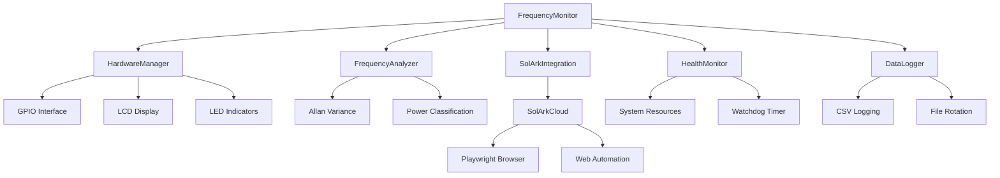

# 🔌 RpiSolarkMonitor

<div align="center">


**A sophisticated frequency monitoring system for Raspberry Pi that detects power source (Utility Grid vs Generator) by analyzing AC line frequency stability.**

[📖 Documentation](#documentation) • [🚀 Quick Start](#quick-start) • [📸 Screenshots](#screenshots) • [🔧 Configuration](#configuration) • [📊 Features](#features)

</div>

---

## 📊 Features

<div align="center">

| 🎯 **Core Monitoring** | 🔧 **Smart Integration** | 📱 **User Interface** |
|:---:|:---:|:---:|
| Real-time frequency analysis | Sol-Ark cloud integration | LCD display with status |
| Power source classification | Automatic parameter updates | LED status indicators |
| Allan variance analysis | Web automation (Playwright) | Web dashboard |
| Health monitoring | Graceful degradation | Comprehensive logging |

</div>

### 🌟 Key Capabilities

- ⚡ **Real-time frequency monitoring** using optocoupler input
- 🔍 **Power source classification** (Utility Grid vs Generac Generator)
- 📈 **Allan variance analysis** for frequency stability assessment
- 📺 **LCD display** with real-time status updates
- 💡 **LED indicators** for instant power source identification
- 🏥 **Health monitoring** with system resource tracking
- 🛡️ **Graceful degradation** when hardware is unavailable
- 📝 **Comprehensive logging** with hourly status reports
- ⚙️ **Configurable parameters** via YAML configuration
- 🧪 **Unit tests** for reliability assurance
- ☁️ **Sol-Ark cloud integration** with automatic parameter updates
- 🤖 **Web automation** using Playwright for cloud platform interaction

## 📸 Screenshots

<div align="center">

### 🖥️ LCD Display Interface

#### 🔌 Utility Grid Mode


#### ⚡ Generator Mode  


*Real-time frequency monitoring showing timestamp, frequency reading, power source classification, and stability assessment*

### 📊 Web Dashboard


*Comprehensive web interface showing frequency analysis and system health*

### 🔧 Hardware Setup


*Clean hardware setup with optocoupler isolation and status indicators*

### 📈 Frequency Analysis


*Advanced frequency analysis showing Allan variance and stability metrics*

</div>

## 🔧 Hardware Requirements

<div align="center">

| Component | Specification | Purpose |
|:---:|:---:|:---:|
| 🍓 **Raspberry Pi** | Any model (3B+, 4B recommended) | Main processing unit |
| 🔌 **H11AA1 Optocoupler** | AC line isolation | Safe frequency detection |
| 📺 **16x2 I2C LCD** | Address 0x27 | Real-time status display |
| 💡 **LEDs** | Green + Red | Power source indicators |
| 🔗 **Resistors** | Various values | Circuit protection |

</div>

### 📋 Shopping List

- [ ] Raspberry Pi 4B (4GB recommended)
- [ ] H11AA1 optocoupler
- [ ] 16x2 I2C LCD display (0x27 address)
- [ ] Green LED (5mm)
- [ ] Red LED (5mm)
- [ ] 220Ω resistors (2x)
- [ ] 1kΩ resistor
- [ ] 10kΩ resistor
- [ ] Breadboard and jumper wires
- [ ] MicroSD card (32GB+)
- [ ] Power supply (5V, 3A)

## 🚀 Quick Start

### 📥 Installation

```bash
# Clone the repository
git clone https://github.com/yourusername/RpiSolarkMonitor.git
cd RpiSolarkMonitor

# Install Python dependencies
pip install -r requirements.txt

# Install Playwright browsers (for Sol-Ark cloud integration)
playwright install chromium

# Enable I2C interface (if not already enabled)
sudo raspi-config
# Navigate to: Interfacing Options → I2C → Enable
```

### ⚡ Quick Setup

```bash
# Run in simulator mode (no hardware required)
python monitor.py --simulator

# Run with real hardware
python monitor.py --real

# Enable verbose logging
python monitor.py --verbose
```

### 🔧 Hardware Configuration

<div align="center">

| Component | GPIO Pin | Connection |
|:---:|:---:|:---:|
| 🔌 Optocoupler Input | GPIO 17 | AC line via optocoupler |
| 💚 Green LED | GPIO 18 | Utility Grid indicator |
| ❤️ Red LED | GPIO 27 | Generator indicator |
| 📺 I2C LCD | SDA/SCL | Address 0x27 |

</div>

### ☁️ Sol-Ark Cloud Setup

1. **Edit configuration**:
   ```yaml
   # config.yaml
   solark_cloud:
     enabled: true
     username: "your_username"
     password: "your_password"
   ```

2. **Test connection**:
   ```bash
   python test_solark_cloud.py
   ```

## 📖 Usage

### 🎮 Basic Commands

<div align="center">

| Command | Description | Use Case |
|:---:|:---:|:---:|
| `python monitor.py` | Default simulator mode | Testing without hardware |
| `python monitor.py --real` | Real hardware mode | Production deployment |
| `python monitor.py --verbose` | Verbose logging | Debugging issues |
| `python test_solark_cloud.py` | Test cloud integration | Verify Sol-Ark connection |

</div>

### 🔧 Command Line Options

```bash
# Available command line options
python monitor.py [OPTIONS]

Options:
  --simulator, -s    Force simulator mode (no hardware required)
  --real, -r         Force real hardware mode
  --verbose, -v      Enable verbose logging
  --help, -h         Show help message
```

### 🧪 Testing & Validation

```bash
# Test Sol-Ark cloud integration
python test_solark_cloud.py

# Download Sol-Ark pages for analysis
python test_solark_cloud.py --download-only

# Run unit tests
python test_monitor.py

# Test hardware components
python hardware.py --test
```

## ⚙️ Configuration

The system uses a comprehensive YAML configuration file `config.yaml`. Here's what you can customize:

<div align="center">

| Category | Settings | Description |
|:---:|:---:|:---:|
| 🔧 **Hardware** | GPIO pins, LCD address | Hardware interface configuration |
| 📊 **Sampling** | Sample rate, buffer duration | Data collection parameters |
| 🎯 **Analysis** | Detection thresholds | Power source classification criteria |
| 📝 **Logging** | Log files, rotation | Logging and data retention |
| 🏥 **Health** | Watchdog timeout, thresholds | System health monitoring |
| ☁️ **Sol-Ark** | Credentials, sync intervals | Cloud integration settings |

</div>

### 📋 Configuration Example

```yaml
# config.yaml
hardware:
  gpio_pins:
    optocoupler: 17
    green_led: 18
    red_led: 27
  lcd_address: 0x27

sampling:
  sample_rate: 1000  # Hz
  buffer_duration: 60  # seconds

analysis:
  generator_threshold: 0.1  # Hz variance threshold
  utility_threshold: 0.05   # Hz variance threshold

solark_cloud:
  enabled: true
  username: "your_username"
  password: "your_password"
  sync_interval: 300  # seconds
```

## 📁 Output Files

<div align="center">

| File | Description | Format |
|:---:|:---:|:---:|
| 📊 `hourly_status.csv` | Hourly status reports | CSV with timestamps |
| 📝 `monitor.log` | Detailed application logs | Rotating log files |
| ☁️ `solark_cache/` | Cached Sol-Ark cloud pages | HTML files for analysis |
| 🔄 `solark_session.json` | Session data | JSON session storage |

</div>

### 📊 Data Logging

The system generates comprehensive logs and data files:

```bash
# View recent logs
tail -f monitor.log

# Check hourly status
cat hourly_status.csv

# Analyze cached Sol-Ark data
ls -la solark_cache/
```

## 🧪 Testing

### 🔬 Unit Tests

```bash
# Run all unit tests
python test_monitor.py

# Run specific test modules
python -m pytest test_monitor.py -v
```

### ☁️ Cloud Integration Tests

```bash
# Test Sol-Ark cloud connection
python test_solark_cloud.py

# Download pages for offline analysis
python test_solark_cloud.py --download-only

# Test parameter synchronization
python test_solark_cloud.py --test-sync
```

### 🔧 Hardware Tests

```bash
# Test hardware components
python hardware.py --test

# Test LCD display
python hardware.py --test-lcd

# Test LED indicators
python hardware.py --test-leds
```

## 🏗️ Architecture

The system is built with a modular, extensible architecture:

<div align="center">



</div>

### 🔧 Core Components

<div align="center">

| Component | Purpose | Key Features |
|:---:|:---:|:---:|
| 🎯 **FrequencyMonitor** | Main application controller | Orchestrates all components |
| 🔧 **HardwareManager** | Hardware abstraction layer | Graceful degradation support |
| 📊 **FrequencyAnalyzer** | Frequency analysis engine | Allan variance, classification |
| 🏥 **HealthMonitor** | System health tracking | Resource monitoring, watchdog |
| 📝 **DataLogger** | Data persistence | CSV logging, file rotation |
| ☁️ **SolArkIntegration** | Cloud integration layer | Parameter synchronization |
| 🤖 **SolArkCloud** | Web automation | Playwright-based interaction |

</div>

### 🔄 Data Flow

1. **Input**: AC line frequency via optocoupler
2. **Processing**: Real-time frequency analysis and classification
3. **Output**: LCD display, LED indicators, logging
4. **Integration**: Sol-Ark cloud parameter updates
5. **Monitoring**: System health and performance tracking

## 🛡️ Graceful Degradation

The system automatically detects hardware availability and adapts accordingly:

<div align="center">

| Scenario | Behavior | Fallback |
|:---:|:---:|:---:|
| 🚫 **No RPi.GPIO** | Runs in simulator mode | Software-only operation |
| 📺 **No LCD Display** | Logs to console | Console output |
| 🔌 **Hardware Errors** | Continues with logging | Error reporting |
| ☁️ **No Sol-Ark Credentials** | Disables cloud integration | Local operation only |
| 🌐 **Network Issues** | Continues local operation | Offline mode |

</div>

### 🔄 Adaptive Operation

The system intelligently adapts to available resources:

```python
# Example: Hardware detection
if not hardware_available:
    logger.info("Hardware not available, running in simulator mode")
    run_simulator()
else:
    logger.info("Hardware detected, running in real mode")
    run_real_hardware()
```

## 📊 Monitoring

The system provides comprehensive monitoring capabilities:

<div align="center">

| Monitoring Type | Description | Output |
|:---:|:---:|:---:|
| 📺 **Real-time Display** | LCD status updates | Visual indicators |
| 💡 **LED Indicators** | Power source status | Green/Red LEDs |
| 🏥 **System Health** | CPU, memory, watchdog | Resource monitoring |
| 📝 **Hourly Logging** | Status reports | CSV files |
| 📋 **Application Logs** | Detailed logging | Rotating log files |
| ☁️ **Cloud Sync** | Sol-Ark integration | Parameter updates |
| ⚡ **Power Management** | Source-based changes | Utility/Generator modes |

</div>

### 📈 Health Metrics

- **CPU Usage**: Real-time processor utilization
- **Memory Usage**: RAM consumption tracking
- **Watchdog Timer**: System responsiveness monitoring
- **Frequency Stability**: Allan variance analysis
- **Power Source**: Utility vs Generator classification
- **Network Status**: Cloud connectivity monitoring

## 🔧 Troubleshooting

### 🚨 Common Issues

<div align="center">

| Issue | Symptoms | Solution |
|:---:|:---:|:---:|
| 🔌 **GPIO Access Denied** | Permission errors | `sudo usermod -a -G gpio pi` |
| 📺 **LCD Not Displaying** | Blank screen | Check I2C address and connections |
| 💡 **LEDs Not Working** | No status indicators | Verify GPIO pin assignments |
| ☁️ **Cloud Connection Failed** | Sol-Ark sync errors | Check credentials and network |
| 📊 **Frequency Reading Errors** | Invalid data | Verify optocoupler connections |

</div>

### 🔍 Diagnostic Steps

1. **📝 Check Logs**: Review `monitor.log` for detailed error information
2. **🔧 Verify Hardware**: Ensure proper GPIO connections and power supply
3. **🧪 Test in Simulator**: Use `--simulator` flag to test without hardware
4. **🔐 Check Permissions**: Ensure GPIO access permissions are correct
5. **⚙️ Review Configuration**: Verify `config.yaml` settings
6. **☁️ Test Sol-Ark Integration**: Run `python test_solark_cloud.py`
7. **📁 Check Cached Pages**: Review `solark_cache/` directory
8. **🔑 Verify Credentials**: Ensure Sol-Ark username/password are correct

### 🆘 Getting Help

- **📋 Check Issues**: Search existing GitHub issues
- **💬 Create Issue**: Report bugs or request features
- **📖 Documentation**: Review configuration examples
- **🧪 Test Mode**: Use simulator mode for debugging

## 🤝 Contributing

We welcome contributions! Here's how you can help:

### 🚀 Quick Start

1. **Fork** the repository
2. **Create** a feature branch: `git checkout -b feature/amazing-feature`
3. **Commit** your changes: `git commit -m 'Add amazing feature'`
4. **Push** to the branch: `git push origin feature/amazing-feature`
5. **Open** a Pull Request

### 📋 Contribution Guidelines

- **Code Style**: Follow PEP 8 Python style guidelines
- **Testing**: Add tests for new features
- **Documentation**: Update README and docstrings
- **Commits**: Use clear, descriptive commit messages

## 📄 License

This project is licensed under the GNU Lesser General Public License v3.0 (LGPL-3.0) - see the [LICENSE](LICENSE) file for details.

The LGPL allows you to:
- ✅ Use this software in proprietary applications
- ✅ Modify and distribute the software
- ✅ Link this library with proprietary code
- ✅ Distribute your application under any license

**Note**: If you modify this library itself, you must make your changes available under the LGPL.

## 🙏 Acknowledgments

- **Raspberry Pi Foundation** for the amazing hardware platform
- **Sol-Ark** for the inverter cloud integration
- **Python Community** for the excellent libraries and tools
- **Contributors** who help improve this project

---

<div align="center">

**⭐ If you find this project helpful, please give it a star! ⭐**

[🔝 Back to Top](#-rpisolarkmonitor)

</div>
